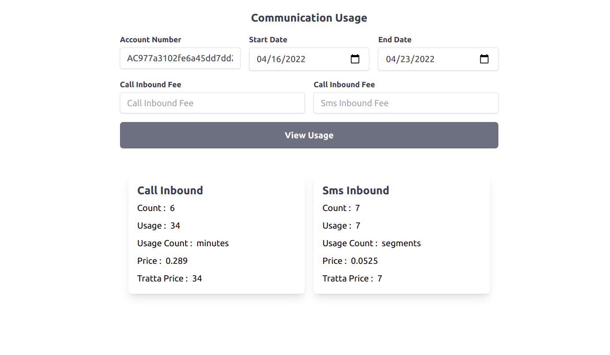

### Development

1- create .env file 
```bash
cp .env.example .env
```
2- install laravel dependencies
```bash
composer install 
```

3- generate application key
```bash
php artisan key:generate 
```

4- install javascript dependencies
```bash
npm install && npm run dev 
```
5- link project
```bash
valet link Or php artisan serve
```

**open root routes will get** 





